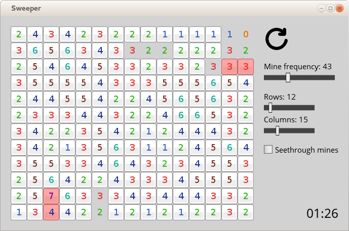

# What #

Sweeper is a variant of Minesweeper in which the mine detection numbers are
also revealed from the start. The catch is that it's inclusive -- a mine in the
square underneath a number is also included in that number.

Also, you can sweep things other than mines if explosions are not your thing.
Simply replace img/mine.png with whatever you want.

# Development #

Sweeper is written in C++ using the [Simple and Fast Media Library][0] for
graphics and windowing.

# Dependencies #

See SFML's tutorial for [installing on Linux][1]. Note that you need **SFML 2**
or above.

[0]: http://www.sfml-dev.org/
[1]: http://www.sfml-dev.org/tutorials/2.2/start-linux.php
